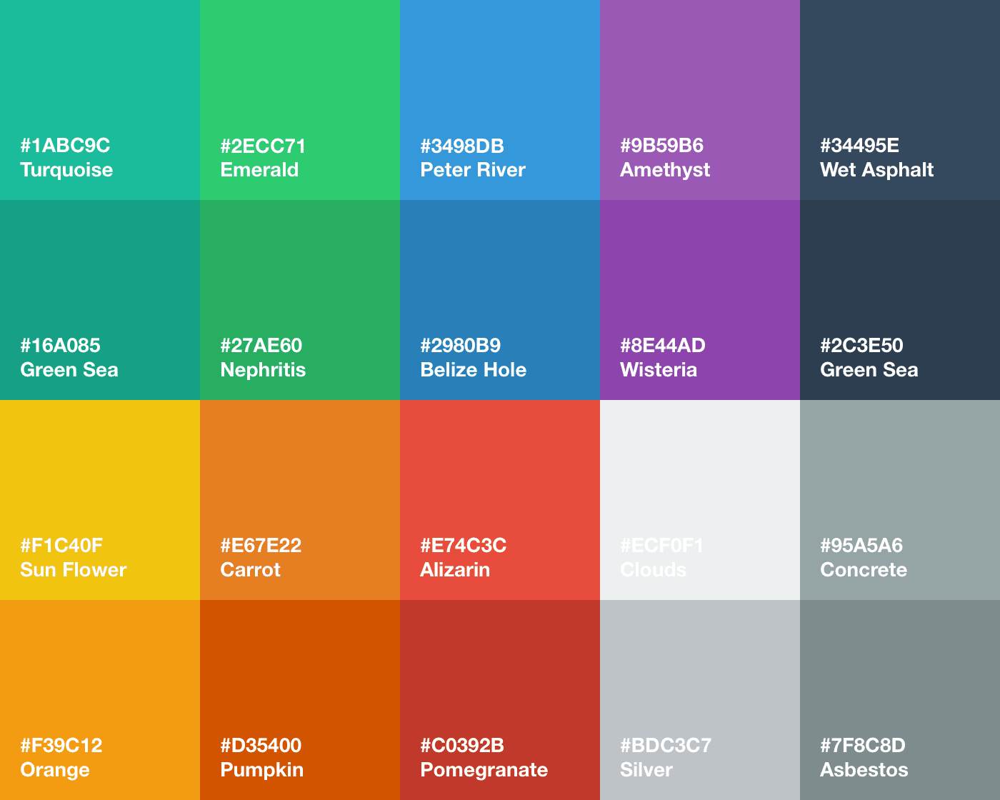

# Flat UI Color Palette for Sketch

[Download the palette](https://github.com/huphtur/Sketch-Flat-UI-Color-Palette/archive/master.zip). Unzip, open in [Sketch](http://bohemiancoding.com/sketch/) and copy the palette into your own document. Use `Control + C` to quickly pick a color.

Based on [these](http://flatuicolors.co) [things](http://flatuicolors.com), originated by Designmodo's [Flat UI](http://designmodo.com/flat/).
